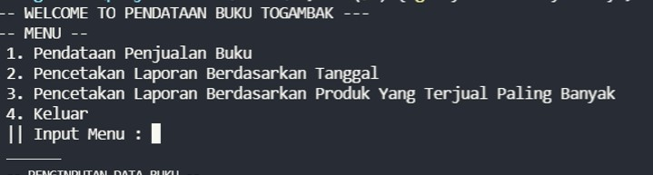
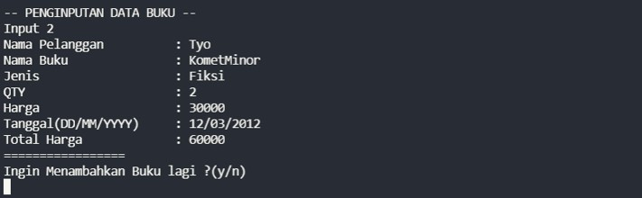
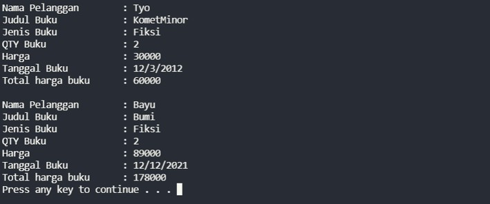
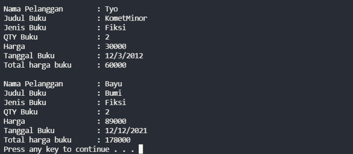
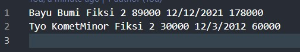

# BOOK SALES - TOGAMAS

  

### asist by :
- 👀 Chantyo
- 👀 Roy 
## Study Case
A company that has just started its business in the field of selling books. Currently, the company wants to create a simple application to sell and at the same time record the results of book sales made per day.

The sales data data will be recorded in a file consisting of:
Tanggal Transaksi
- Nama pelanggan
- Jenis buku
- Nama buku
- Jumlah buku
- Harga buku
- Total pembayaran

### Main Feature 
1. Data collection or Add data
2. Sort by date
3. Sort by Most Sales

Copy The Result On dic _final_
``
    cd final
``

## Terminal View
- Display All Menu

- Menu 1

- Menu 2

- Menu 3

After the program exit, all data will be record on sales .txt

